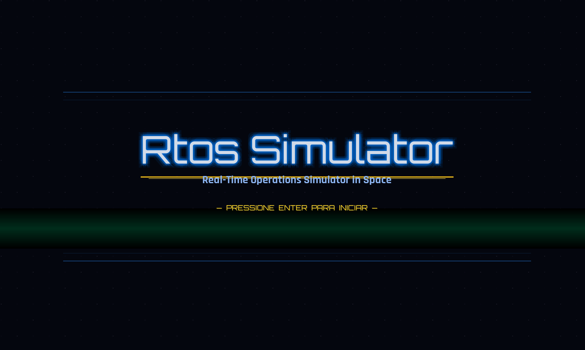
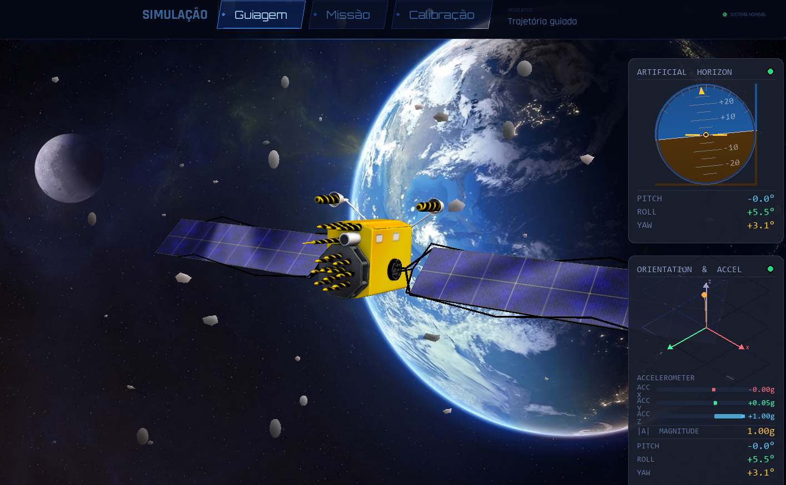

<div align="center">


# 🛰️ RTOS Simulator

**Simulador de Atitude de Satélite em Tempo Real**

[](https://python.org)
[](https://freertos.org)
[](https://opengl.org)
[](https://raspberrypi.com)

*Visualização 3D de satélite orientada por dados reais do sensor MPU6050 via FreeRTOS*

</div>
<div align="center">
  
</div>

---

## O que é este projeto?

O **RTOS Simulator** conecta hardware embarcado e visualização em tempo real: um sensor **MPU6050** (acelerômetro + giroscópio) roda em uma **Raspberry Pi Pico W** com **FreeRTOS**, transmite ângulos de pitch/roll/yaw via USB serial, e um simulador **Python/OpenGL** usa esses dados para animar um modelo 3D de satélite.

Quando o sensor não está disponível, o sistema entra em modo de simulação interna, mantendo toda a narrativa visual funcionando.

<div align="center">
  
</div>


---

## Demonstração rápida

```
sensor MPU6050
     │  I2C  
Raspberry Pi Pico W  ──── FreeRTOS task ────► USB Serial (115200 baud)
                                                       │
                                               leitor_serial_v3.py
                                                       │
                                           rocket_visualizer.py (OpenGL)
                                                       │
                                          ┌────────────▼────────────┐
                                          │  Modelo 3D do satélite  │
                                          │  Horizonte Artificial   │
                                          │  Gráfico IMU            │
                                          └─────────────────────────┘
```

---

## Modos de operação

O simulador possui três modos, selecionáveis pelo painel superior ou pela tecla `N`:

| Modo | Descrição |
|------|-----------|
| 🎮 **Guiagem** | Trajetória guiada com movimentos suaves; meteoros e detritos orbitais ativos |
| 🛰️ **Missão** | Sequência narrativa em 3 fases com atitude dirigida pelo sensor ou simulada |
| 🔧 **Calibração** | Leitura dos dados brutos do acelerômetro e giroscópio; zeragem de ângulos |

### Modo Missão — detalhamento das fases

```
[INTRO] ──S──► [AVISO 5s] ──► [CHUVA 5s] ──► [CORREÇÃO 10s] ──► [PERGUNTA]
   └──N──► encerrado                                                │  └──S──► [AVISO] (reinicia)
                                                                    └──N──► encerrado
```

| Fase | Duração | O que acontece |
|------|---------|----------------|
| **INTRO** | Aguarda `S`/`N` | Painel explicativo das 3 fases. O satélite permanece estável. |
| **AVISO** | 5 s | Contagem regressiva com alerta visual piscante. |
| **CHUVA** | 5 s | Pitch/roll/yaw oscilam caoticamente. Chuva de meteoros intensa. |
| **CORREÇÃO** | 15 s | Propulsores virtuais retornam o satélite ao nominal. Barra de progresso. |
| **PERGUNTA** | Aguarda `S`/`N` (mín. 2 s) | Missão concluída — repetir? |

> Se o MPU6050 estiver conectado, os ângulos **reais** do hardware substituem a simulação em todas as fases.

---

## Estrutura do repositório

```
RTOS_simulator/
│
├── simulador_RTOS/                  # Simulador Python
│   ├── rocket_visualizer.py         # Loop principal (OpenGL + máquina de estados)
│   ├── paineis_imu_v2.py            # Horizonte artificial e gráfico IMU 2D
│   ├── leitor_serial_v3.py          # Thread de leitura serial assíncrona
│   ├── meu_objeto3.obj / .mtl       # Modelo 3D do satélite (+ textura difusa)
│   └── fundo.png                    # Textura do fundo estrelado
│
├── MPU6050_RTOS_BitDogLab/          # Firmware embarcado
│   ├── RTOS_leitor_mpu.c            # Tarefa FreeRTOS: lê MPU6050 e envia serial
│   ├── FreeRTOSConfig.h             # Configurações do kernel
│   └── CMakeLists.txt
│
├── img/                             # Screenshots e mídia
└── README.md
```

---

## Hardware necessário

| Componente | Especificação |
|------------|--------------|
| Microcontrolador | Raspberry Pi Pico W |
| Sensor IMU | MPU6050 (acelerômetro + giroscópio 6 DOF) |
| Conexão | USB (serial CDC) |
| Barramento | I2C — SDA: GPIO 0 · SCL: GPIO 1 · 400 kHz |
| Endereço I2C | `0x68` |

**Diagrama de conexão MPU6050 → Pico W:**

```
MPU6050          Raspberry Pi Pico W
────────         ────────────────────
VCC      ──────  3V3 (pin 36)
GND      ──────  GND (pin 38)
SDA      ──────  GPIO 0 (pin 1)
SCL      ──────  GPIO 1 (pin 2)
AD0      ──────  GND   (endereço 0x68)
```

---

## Firmware (FreeRTOS)

O arquivo `RTOS_leitor_mpu.c` cria uma única tarefa FreeRTOS (`vTaskMPU`) que:

1. Aguarda 3 s para estabilização da USB após boot.
2. A cada **500 ms**, lê acelerômetro, giroscópio e temperatura do MPU6050 via I2C.
3. Calcula pitch e roll a partir dos valores brutos do acelerômetro.
4. Envia os dados pelo **USB serial** no formato que o Python espera:

```
Acel  -> X:  0.012 g  Y: -0.034 g  Z:  0.998 g
Gyro  -> X:    124     Y:    -56     Z:     23
Pitch:  2.34      Roll: -1.23
Temp : 24.56 C
```

### Compilar e gravar

```bash
cd MPU6050_RTOS_BitDogLab/
mkdir build && cd build
cmake ..
make
# copie o arquivo .uf2 gerado para o Pico W em modo BOOTSEL
```

**Dependências do firmware:**
- [Raspberry Pi Pico SDK](https://github.com/raspberrypi/pico-sdk)
- [FreeRTOS-Kernel para Pico](https://github.com/FreeRTOS/FreeRTOS-Kernel)
- CMake ≥ 3.13

---

## Simulador Python

### Instalação

```bash
pip install pygame PyOpenGL numpy pyserial
```

### Executar

```bash
cd simulador_RTOS/
python rocket_visualizer.py
```

Pressione `ENTER` na tela de splash para iniciar.

> **Porta serial:** verifique a variável `SERIAL_PORT` no início de `rocket_visualizer.py` (padrão: `COM6` no Windows). No Linux, use `/dev/ttyACM0` ou similar.

### Controles

| Tecla | Contexto | Ação |
|-------|----------|------|
| `ENTER` | Splash | Iniciar o simulador |
| `ESPAÇO` | Sempre | Pausar / retomar |
| `N` | Fora de diálogos | Próximo modo |
| `S` / `N` | Diálogos da Missão | Confirmar / cancelar |
| `R` | Sempre | Resetar câmera |
| `P` | Sempre | Mostrar/ocultar ponteiro 3D |
| `C` | Calibração | Zerar ângulos |
| `ESC` | Sempre | Sair |
| Mouse drag (btn esq.) | 3D | Rotacionar câmera |
| Scroll do mouse | 3D | Zoom in/out |

### Fontes (opcional)

O sistema detecta automaticamente fontes `.ttf` na pasta do projeto. Para a estética completa, coloque na pasta raiz:

| Família | Arquivo |
|---------|---------|
| Display | `Orbitron-VariableFont_wght.ttf` |
| Mono | `ShareTechMono-Regular.ttf` |
| Label | `Rajdhani-Regular.ttf` / `Rajdhani-Bold.ttf` |

Se não encontradas, são usados fallbacks do sistema operacional.

---

## Arquitetura do simulador

O `rocket_visualizer.py` é organizado em camadas:

```
┌──────────────────────────────────────────────────────┐
│                    Loop principal                    │
│  eventos → lógica → OpenGL 3D → overlay 2D pygame   │
└──────────┬────────────┬───────────────┬──────────────┘
           │            │               │
    MaquinaMissao   Camera          PainelModos
    (máquina de     (orbital,       (UI superior,
     estados)       drag+zoom)       fade entre modos)
           │
    FiltroAngulo  ←──  LeitorSerial (thread)  ←── MPU6050
    (complementar)
```

**Principais classes:**

| Classe | Responsabilidade |
|--------|-----------------|
| `MaquinaMissao` | Máquina de estados (IDLE → INTRO → AVISO → CHUVA → CORREÇÃO → PERGUNTA) |
| `FiltroAngulo` | Lê pitch/roll/yaw do `LeitorSerial` e aplica suavização |
| `Camera` | Câmera orbital com drag e zoom via mouse |
| `PainelModos` | Barra superior com botões animados de seleção de modo |
| `Meteoros` | Sistema de partículas para chuva de meteoros |
| `Detritos` | Partículas de detritos orbitais em parallax |
| `GerenciadorFontes` | Carrega fontes TTF com fallback para fontes do sistema |

---

## Pré-requisitos de sistema

| Item | Versão mínima |
|------|--------------|
| Python | 3.10 |
| Sistema operacional | Windows 10 / Ubuntu 20.04 / macOS 12 |
| OpenGL | 2.1 (suporte a VBO e iluminação por hardware) |
| RAM | 512 MB livres recomendado |

---

## Contribuições

Contribuições são bem-vindas. Ideias para próximas versões:

- Exportar log de atitude para CSV com timestamp.
- Modo replay de missões gravadas.
- Suporte a outros sensores (BNO055, ICM-42688).
- Animação dos painéis solares no modelo 3D.
- Protocolo serial mais robusto com checksum.

---

## Licença

Distribuído sob a licença **MIT**. Consulte o arquivo `LICENSE` para mais detalhes.

---

<div align="center">

Desenvolvido por **Theógenes Gabriel** — [@TheogenesGabriel](https://github.com/TheogenesGabriel)

*Projeto de Sistemas Operacionais de Alta Criticidade — 2026*

🛰️

</div>
